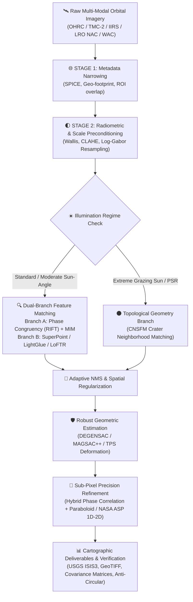

# Lunar Multi-Modal Image Correspondence Suite: Architecture Documentation Hub
> **Smart India Hackathon (SIH) — Problem Statement 26166**  
> **Master Documentation Directory & Architectural Knowledge Base**

---

## 🛰️ 1. System Overview

This repository houses the complete architecture, research, algorithmic formulations, and pipeline specifications for autonomous, sub-pixel, multi-modal correspondence matching across lunar orbital imagery (Chandrayaan-2 **OHRC**, **TMC-2**, **IIRS**; LRO **NAC**, **WAC**; **SELENE TC/MI**; **LOLA** DEMs).



---

## 🗂️ 2. Documentation Directory Structure

All documentation and specifications are placed directly within [`/ARCHITECTURE/docs`](file:///Abhi/Projects/SIH/ARCHITECTURE/docs):

```
ARCHITECTURE/docs/
├── README.md                                  # This documentation portal & master index
├── SESSION_LOGS.md                            # Documentation session logs & change tracker
│
├── MASTER_SYSTEM_ARCHITECTURE.md              # End-to-end master system architecture & specs
├── BEST_ARCHITECTURE_KNOWN.md                 # Benchmark evaluation of optimal architecture
├── IMPLEMENTATION_ARCHITECTURE.md             # Low-level 6-stage implementation architecture
├── ARCHITECTURE_COMPANION.md                  # Detailed rationale, tradeoffs & deep dives
├── ARCHITECTURE_REVIEW.md                     # Critical architectural reviews & failure modes
├── ARCHITECTURE_DOC_REVIEW.md                 # Review notes on design consistency
│
├── BEST_PIPELINE.md                           # Optimal end-to-end execution pipeline
├── COMPLETE_PIPELINE.md                       # Full end-to-end pipeline specification
│
├── RIFT_PHASE_CONGRUENCY.md                   # Radiation-Invariant Feature Transform
├── SUPERGLUE_GNN.md                           # Graph Neural Network feature matching
├── LOFTR_DETECTOR_FREE.md                     # Detector-free local feature matching (Transformers)
├── KAZE_NONLINEAR_SCALE_SPACE.md              # Non-linear scale space feature detection
├── TRADITIONAL_VS_DEEP_LEARNING.md            # Comprehensive Classical vs DL comparison
├── DESCA_DESCRIPTOR_ANALYSIS.md               # DESCA descriptor & illumination analysis
├── SIFT_IIRS_WAC_ANALYSIS.md                  # Multi-sensor SIFT analysis (IIRS to WAC)
├── MOONMETASYNC_ANALYSIS.md                   # Metadata-driven multi-resolution synchronization
│
├── CNSFM_CRATER_NEIGHBORHOOD_MATCHING.md      # Crater neighborhood structure geometric matching
├── HYBRID_PHASE_CORRELATION.md                # Sub-pixel FFT phase correlation & paraboloid fitting
├── NASA_SUBPIXEL_REFINEMENT.md                # NASA Ames Stereo Pipeline 1D/2D subpixel refinement
├── RADIOMETRIC_NORMALIZATION_ANALYSIS.md      # Photometric, CLAHE, and Wallis filtering
│
├── SIH26166_REFERENCE_MAPPING.md              # Academic paper & payload cross-reference table
├── SIH26166_SUPPLEMENTARY_RESEARCH.md         # Extended research benchmarks & payloads
└── ADDITIONAL_RESOURCES.md                    # Tooling, datasets & ISIS3/GDAL resources
```

---

## 📑 3. Quick Reference by Category

### Pillar 1: Master System Architecture
*   [**Master System Architecture & Technical Specification**](file:///Abhi/Projects/SIH/ARCHITECTURE/docs/MASTER_SYSTEM_ARCHITECTURE.md)  
    *Executive summary, mathematical formulations, 6 physical challenges, multi-resolution cascade, and ISIS3 export.*
*   [**Best Architecture Known**](file:///Abhi/Projects/SIH/ARCHITECTURE/docs/BEST_ARCHITECTURE_KNOWN.md)  
    *Synthesis of tested methods, failure-mode analysis, and optimal configuration recommendations.*
*   [**Implementation Architecture**](file:///Abhi/Projects/SIH/ARCHITECTURE/docs/IMPLEMENTATION_ARCHITECTURE.md)  
    *6-stage cascade (Narrow $\rightarrow$ Detect $\rightarrow$ Match $\rightarrow$ Filter $\rightarrow$ Refine $\rightarrow$ Validate) with code structures and runtime guarantees.*
*   [**Architecture Companion**](file:///Abhi/Projects/SIH/ARCHITECTURE/docs/ARCHITECTURE_COMPANION.md)  
    *In-depth architectural design rationales, edge cases, and hardware acceleration strategies.*
*   [**Architecture Reviews**](file:///Abhi/Projects/SIH/ARCHITECTURE/docs/ARCHITECTURE_REVIEW.md) | [**Doc Review**](file:///Abhi/Projects/SIH/ARCHITECTURE/docs/ARCHITECTURE_DOC_REVIEW.md)  
    *Critical peer reviews, stress tests, and gap analyses.*

---

### Pillar 2: Pipeline Specifications
*   [**Best Pipeline Guide**](file:///Abhi/Projects/SIH/ARCHITECTURE/docs/BEST_PIPELINE.md)  
    *Deterministic step-by-step pipeline execution from raw SPICE ancillary data to orthomosaic output.*
*   [**Complete Pipeline Specification**](file:///Abhi/Projects/SIH/ARCHITECTURE/docs/COMPLETE_PIPELINE.md)  
    *Comprehensive algorithmic flowcharts, parameter tuning matrices, and fallback heuristics.*

---

### Pillar 3: Feature Detection & Matching
*   [**RIFT (Radiation-variation Insensitive Feature Transform)**](file:///Abhi/Projects/SIH/ARCHITECTURE/docs/RIFT_PHASE_CONGRUENCY.md)  
    *Log-Gabor multi-scale phase congruency & Maximum Index Map (MIM) for cross-modal matching.*
*   [**SuperGlue GNN Matching**](file:///Abhi/Projects/SIH/ARCHITECTURE/docs/SUPERGLUE_GNN.md)  
    *Attentional Graph Neural Networks with Sinkhorn optimal transport.*
*   [**LoFTR: Detector-Free Feature Matching**](file:///Abhi/Projects/SIH/ARCHITECTURE/docs/LOFTR_DETECTOR_FREE.md)  
    *Transformer-based dense-to-fine matching in low-texture lunar regolith.*
*   [**KAZE Non-Linear Scale Space**](file:///Abhi/Projects/SIH/ARCHITECTURE/docs/KAZE_NONLINEAR_SCALE_SPACE.md)  
    *AOS-driven non-linear diffusion filtering for edge-preserving feature detection.*
*   [**Traditional vs. Deep Learning Feature Matching**](file:///Abhi/Projects/SIH/ARCHITECTURE/docs/TRADITIONAL_VS_DEEP_LEARNING.md)  
    *Benchmarked comparisons across RMSE, inlier ratio, and compute latency.*
*   [**DESCA Descriptor Analysis**](file:///Abhi/Projects/SIH/ARCHITECTURE/docs/DESCA_DESCRIPTOR_ANALYSIS.md)  
    *Illumination invariant descriptor analysis based on Dr. Sourabh et al.*
*   [**SIFT IIRS to WAC Analysis**](file:///Abhi/Projects/SIH/ARCHITECTURE/docs/SIFT_IIRS_WAC_ANALYSIS.md)  
    *Transitive registration across $80\,\text{m}$ (IIRS) and $100\,\text{m}$ (WAC) data.*
*   [**MoonMetaSync Analysis**](file:///Abhi/Projects/SIH/ARCHITECTURE/docs/MOONMETASYNC_ANALYSIS.md)  
    *Metadata synchronization and spatial bounding.*

---

### Pillar 4: Sub-Pixel Precision & Geometry
*   [**CNSFM: Crater Neighborhood Structure Feature Matching**](file:///Abhi/Projects/SIH/ARCHITECTURE/docs/CNSFM_CRATER_NEIGHBORHOOD_MATCHING.md)  
    *Topological crater graph matching for extreme grazing angles and shadow inversions.*
*   [**Hybrid Phase Correlation**](file:///Abhi/Projects/SIH/ARCHITECTURE/docs/HYBRID_PHASE_CORRELATION.md)  
    *FFT cross-power spectrum with continuous paraboloid fitting yielding $<0.1\,\text{px}$ accuracy.*
*   [**NASA Sub-Pixel Refinement (ASP 1D/2D)**](file:///Abhi/Projects/SIH/ARCHITECTURE/docs/NASA_SUBPIXEL_REFINEMENT.md)  
    *NASA Ames Stereo Pipeline sub-pixel correlation strategies and error bounds.*
*   [**Radiometric Normalization Analysis**](file:///Abhi/Projects/SIH/ARCHITECTURE/docs/RADIOMETRIC_NORMALIZATION_ANALYSIS.md)  
    *Wallis filtering, CLAHE, and Lommel-Seeliger / Hapke photometric models.*

---

### Pillar 5: Research & Benchmarks
*   [**SIH26166 Reference Mapping**](file:///Abhi/Projects/SIH/ARCHITECTURE/docs/SIH26166_REFERENCE_MAPPING.md)  
    *Correlation between SIH problem requirements and published academic literature.*
*   [**Supplementary Research**](file:///Abhi/Projects/SIH/ARCHITECTURE/docs/SIH26166_SUPPLEMENTARY_RESEARCH.md)  
    *Extended sensor analyses for DFSAR, SELENE MI, and LOLA altimetry.*
*   [**Additional Resources**](file:///Abhi/Projects/SIH/ARCHITECTURE/docs/ADDITIONAL_RESOURCES.md)  
    *Datasets (PDS, ISSDC), ISIS3 commands, GDAL scripts, and baseline repos.*

---

## 🎯 4. Target Precision & Sensor Specifications

| Sensor / Dataset | Ground Sample Distance (GSD) | Spectral Band | Key Geometric Challenge | Optimal Matching Strategy |
| :--- | :--- | :--- | :--- | :--- |
| **Chandrayaan-2 OHRC** | $0.25\,\text{m} - 0.32\,\text{m}$ | Panchromatic ($450-900\,\text{nm}$) | Micro-topography shadows, steep relief | LightGlue / LoFTR + Phase Correlation |
| **LRO NAC** | $0.5\,\text{m} - 1.2\,\text{m}$ | Panchromatic ($400-750\,\text{nm}$) | Cross-orbit illumination shifts | RIFT Phase Congruency + SuperGlue |
| **Chandrayaan-2 TMC-2** | $5.0\,\text{m}$ | Triplet Stereo (Fore/Nadir/Aft) | Stereo parallax & baseline disparity | Epipolar-constrained SIFT / KAZE |
| **Chandrayaan-2 IIRS** | $80.0\,\text{m}$ | Hyperspectral ($0.8-5.0\,\mu\text{m}$) | Low resolution vs OHRC ($320\times$ gap) | Transitive (OHRC $\to$ NAC $\to$ WAC $\to$ IIRS) |
| **LRO WAC** | $100.0\,\text{m}$ | 7-band multispectral | Global reference basemap | Normalized Mutual Info / CNSFM |
| **LOLA DEM** | $59\,\text{m} - 118\,\text{m}$ | 1064 nm Laser Altimeter | Radiometry-free topographic truth | Synthetic Hillshade Raytracing + PC |
